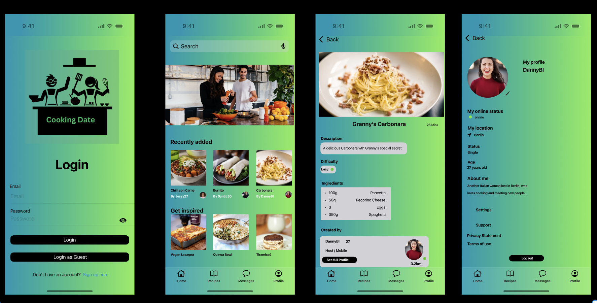

# Cooking Date 🍽️👨🏽‍🍳❤️👩

**Cook Together, Make Friends, Find Love, Share Flavors.**  


<br clear="all">

## 🖥️ Overview
<p> Cooking Date is a social culinary app that connects food enthusiasts through shared recipes. Discover local cooks, collaborate in kitchens, and find your perfect "culinary match" using SwiftUI and Firebase.</p>

## 📋 Contents
- [Overview](#-overview)
- [Screenshots](#-screenshots)
- [Installation](#-installation)
- [Features](#-features)
- [Technical Stack](#-technical-stack)
- [Libraries](#-libraries)
- [Author](#-author)

## 📸 Screenshots 


<br clear="all">

## ✨ Features

<ol>
<li>🔍 Find Nearby Recipes – Search for delicious recipes uploaded by users near you.</li>
<li>💬 Chat & Connect – Message the recipe uploader to plan a cooking date.</li>
<li>📍 Arrange a Meet-up – Set up where and when to cook together.</li>
<li>❤️ More Than Just Cooking – Who knows? It could be the start of a great relationship!</li>
</ol>

## 📲 Installation
1. Clone repo:
   ```bash
   git clone https://github.com/eduSwift/CookingDate

2. Navigate to the project folder:
   ```bash
   cd cooking-date
3. Open the project in Xcode and run it on a simulator or a real device.


## 🚀 Technical Stack

### Core Components
- **[SwiftUI](https://developer.apple.com/xcode/swiftui/)** - UI Framework
- **[Firebase](https://firebase.google.com/docs/firestore)** - Backend Services:
  - Firestore (Recipe/Chat storage)
  - Authentication (Social logins)
  - Cloud Functions (Location filtering)
  - Cloud Messaging (Notifications)
- **[MapKit](https://developer.apple.com/documentation/mapkit/)** - Location Services

## 📚 Libraries
[TheMealDB](https://www.themealdb.com)** - API for recipes


## 👨🏻‍💻 Author
**[Eduardo Rodrigues](https://www.linkedin.com/in/eduardo-rodriguescruz/)**
